# BasicMetasploit

## What is Metasploit?
 **Standardized framework for used primarly in offensive security.**
 ## Metasploit Interfaces:
 **msfconsole**
 **msfcli**
 **Armitage**
 **msfweb**

 # Getting Started with Metasploit
 ***systemctl start postgresql*
 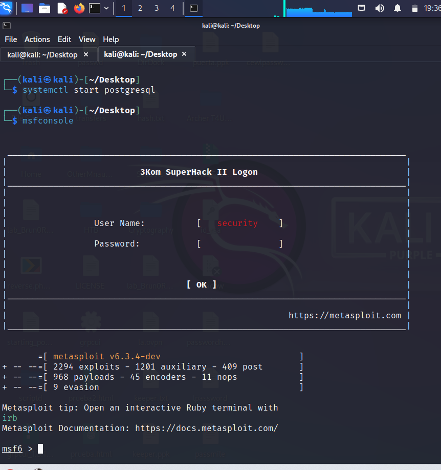
 
 
## Metasploit Modules 
* **Exploits**
* **payloads**
* **auxiliary**
* **nops**
* **post**
* **encoders**
* **evasion**
## Framework Directory:
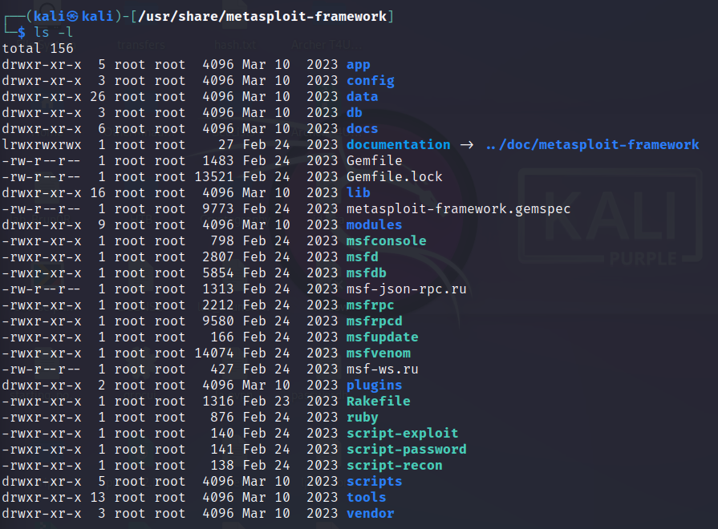

## Rankings of Success
* **Excellent**
* **Great**
* **Good**
* **Average**
* **Manual**

## Auxiliary 

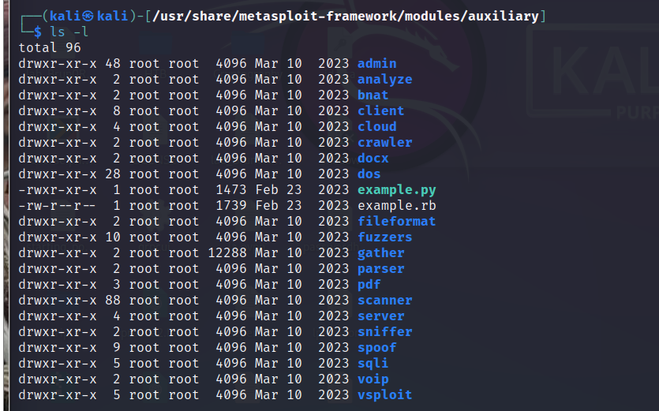

## Port Scaning with Metasploit 
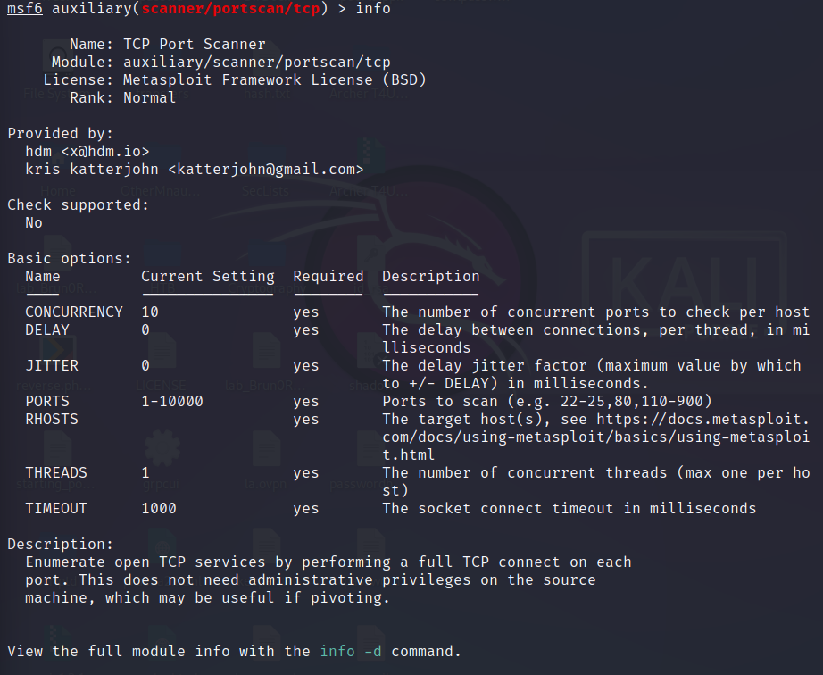

**Results of The scanning**
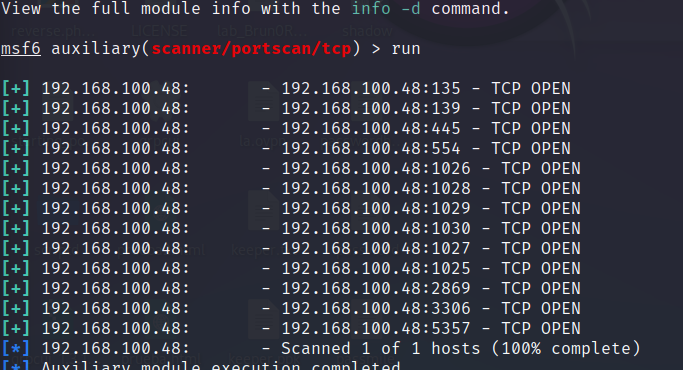

## Metasploit Vulnerability Scanning
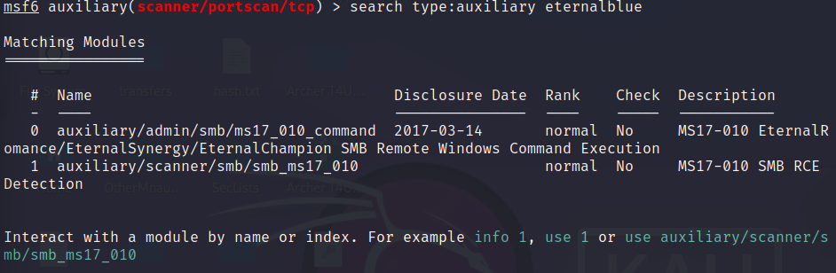

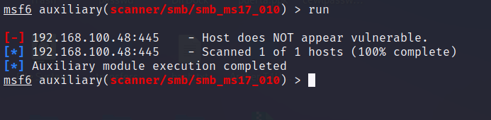

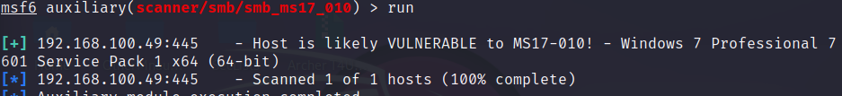

## Explotation with eternal Blue

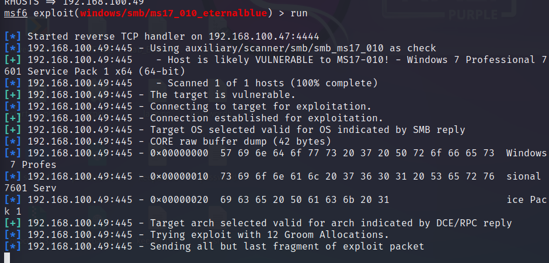

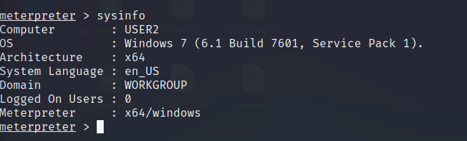
-----------------------------------------
## Creating a Malicious File with msfvenom
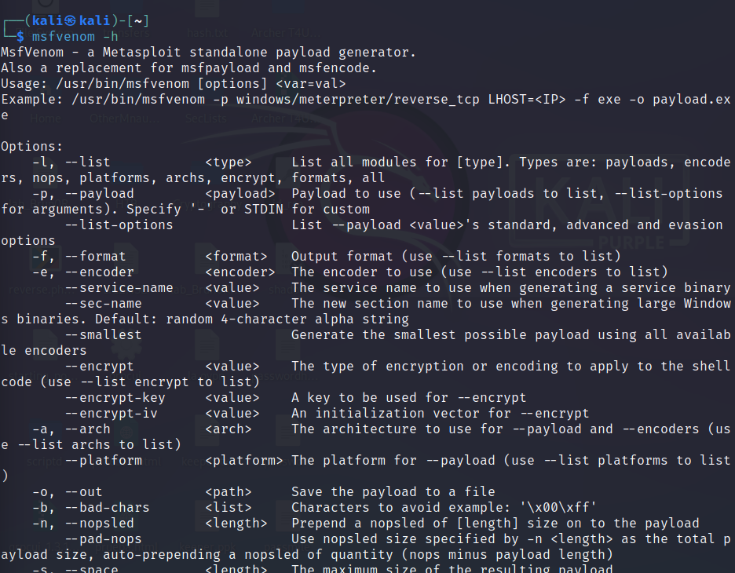
### Encoderes 
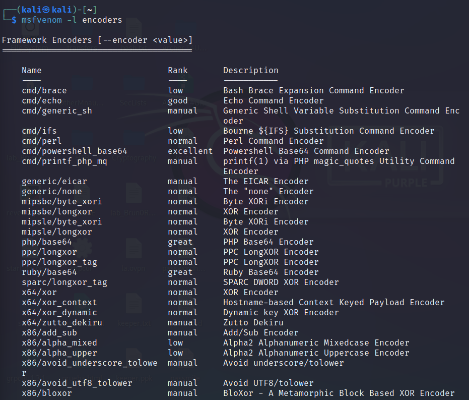
### Platforms 
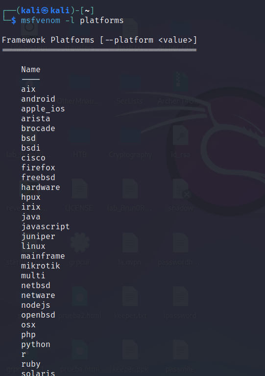

### Creating a malicious file
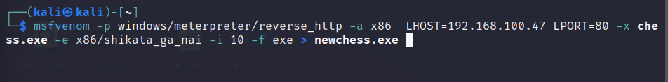

